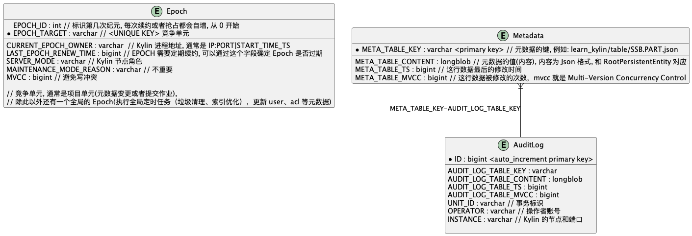

:::tip Before your read
**Target Audience**
- 对 Kylin 5.0 元数据存储, 元数据缓存, 以及节点间元数据同步机制感兴趣的用户和开发者.
- 在二次开发过程中, 想了解对 Kylin 5.0 进行元数据读写操作的最佳实践和注意事项的开发者.
- 想对 Kylin 5.0 的元数据进行升级改造的开发者.


**What will you learn**
- 了解在 Kylin 5 如何进行读写元数据操作

💬 Kylin 5 的开发者需要了解元数据读写的逻辑的实现和技术细节
:::

<!--truncate-->


### Target Audience

这篇文档是为有以下需求的用户和开发者而准备的:
1. 对 Kylin 5.0 元数据存储, 元数据缓存, 以及节点间元数据同步机制感兴趣的用户和开发者.
2. 在二次开发过程中, 想了解对 Kylin 5.0 进行元数据读写操作的最佳实践和注意事项的开发者.
3. 想对 Kylin 5.0 的元数据进行升级改造的开发者.

### Terminology

#### Core Class and Interface

| Class                   | Comment                                            |
|-------------------------|----------------------------------------------------|
| ResourceStore           | 用于管理内存中对元数据的操作                                     |
| InMemResourceStore      | ResourceStore 的实现类, 用于绝大部分情况                       |
| ThreadViewResourceStore | ResourceStore 的实现类, 作为一个沙盒式的 ResourceStore, 在事务中使用 |
| MetadataStore           | 用于管理元数据持久化的操作                                      |
| AuditLogStore           | 用于节点间元数据同步, 以及诊断元数据异常情况                            |
| Epoch                   | 用于保证同时只有一个进程对指定项目下的元数据进行修改操作, 或者提交作业               |
| EpochStore              | 用于持久化 Epoch                                        |


### Transaction of metadata CRUD

#### Why Kylin 5.0 need transaction(of metadata) ?
因为用户操作可能同时操作多个元数据, 这些元数据变更必须保持一致性, 要么同时变更成功要么同时变更失败, 不允许出现中间状态.
例如, 如果用户修改 DataModel 的维度和度量, IndexPlan 也需要随之同时变更, 两者必须保持一致性.

#### How transaction was implemented？
检查 [元数据更新流程图](#metadata_write)

#### How should I write a piece of meta?

1. 使用注解 Transaction

   使用 `@org.apache.kylin.rest.aspect.Transaction` 对你的业务方法进行注解, 这个在你的方法比较简短(轻量)的情况比较推荐
    ```java
    class JobService{
        
      @Transaction(project = 0)
      public ExecutableResponse manageJob(String project, ExecutableResponse job, String action) throws IOException {
          Preconditions.checkNotNull(project);
          Preconditions.checkNotNull(job);
          Preconditions.checkArgument(!StringUtils.isBlank(action));
      
          if (JobActionEnum.DISCARD == JobActionEnum.valueOf(action)) {
              return job;
          }
      
          updateJobStatus(job.getId(), project, action);
          return getJobInstance(job.getId());
      }
    }
    ```
2. 使用 EnhancedUnitOfWork

   使用 `EnhancedUnitOfWork.doInTransactionWithCheckAndRetry` 来包含你的业务代码(元数据修改代码)
    ```java
    class SomeService {
        public void renameDataModel() {
            // some codes not in transaction
            EnhancedUnitOfWork.doInTransactionWithCheckAndRetry(() -> {
                // 1. Get XXXManager, such as NDataModelManager
                KylinConfig config = KylinConfig.getInstanceFromEnv(); // thread local KylinConfig was created in startTransaction
                NDataModelManager manager = config.getManager(project, NDataModelManager.class);
                // 2. Get RootPersistentEntity by XXXManager and Update XXX
                NDataModel nDataModel = modelManager.getDataModelDesc(modelId);
                checkAliasExist(modelId, newAlias, project);
                nDataModel.setAlias(newAlias);
                NDataModel modelUpdate = modelManager.copyForWrite(nDataModel);
                // 3. Call updateXXX method of XXXManager
                modelManager.updateDataModelDesc(modelUpdate);
            }, project);
            // some more codes not in transaction
        }
    }
    ```

:::info 元数据操作须知
1. KylinConfig 和 XXXManager(例如:NDataModelManager) 需要在事务内获取,
   原因在于事务开启时准备了一个事务专用的单独的 KylinConfig, 单独的 KylinConfig 绑定了事务需要的 ResourceStore
2. 开启多线程修改元数据需要注意, 原因在于新的线程并不能获取事务开启时准备的 KylinConfig, 而是全局的 KylinConfig
3. 两个事务写的时候别复用同一个对象, 以避免元数据更新时, MVCC 检查失败
:::

### Epoch

1. 什么是 Epoch?

   竞争单元： 由于同时存在多个 leader，多个 leader 会竞争成为单元的 owner

    - 全局竞争单元：执行全局定时任务（垃圾清理、索引优化），更新 user、acl 等元数据；
    - 项目竞争单元：项目级定时任务，项目内元数据变更；
   
   Epoch （纪元）：每个竞争单元发生一次占有的变化，就称为一个 epoch。<br></br>每个竞争单元都会独立地在元数据中记录自己的纪元相关属性。

2. 什么样的进程可以获取 Epoch?

    Job 和 All, Query 不可以获得 Epoch, Query 节点被设计为不需要提交任务或者是修改元数据.

3. Epoch 如何管理?

    all 节点与 job 节点在刚启动时，就会启动定时任务，也就是心跳检测时间： kylin.server.leader-race.heart-beat-interval 参数来控制时间间隔，不断地去竞争 epoch。
    如果当前项目的 epoch owner 不合法，那么就会进行抢占，以下情况可以成功抢占：
      - epoch owner 为空（节点停止时，会清空 current_epoch_owner）
      - 当前 epoch owner 已经过期，过期判断逻辑：(当前时间 - last_epoch_renew_time) > kylin.server.leader-race.heart-beat-timeout（心跳检测超时时间）

4. 疑问 
   
    **如何防止脑裂**？

    脑裂：两个节点都认为自己是 epoch owner。<br></br>
    在开启事务前、写入数据库前都会进行 epoch owner 检查，只有正确的 owner 才能成功写入元数据。
    
    **节点下线**

    Kylin 节点停止时，会将当前节点所有子进程都杀死。最终是调用 sbin/ kill-process-tree.sh 脚本，对每个子进程，先 kill，kill 后还没停止的话，等 5s，还没停止的话，再执行 kill -9 pid。
    节点停止时，真个 kill 过程，超时时间是 1 分钟，会打印相关日志。<br></br>
    成功： Destroy process {pid} of job {jobId} SUCCEED.<br></br>
    失败： Destroy process {pid} of job {jobId} FAILED.<br></br>
    超时： Destroy process {pid} of job {jobId} TIMEOUT exceed 60s.

    **负载不均衡**

    启动时：先启动的节点会抢占所有 epoch；<br></br>
    节点下线：如果某个节点下线，它占有的所有 epoch 会释放，可能会被一个节点抢占到；<br></br>
    可以通过 API 可以更新 epoch owner。<br></br>

5. 相关类

    - EpochOrchestrator
    - EpochOrchestrator.EpochChecker
    - EpochOrchestrator.EpochRenewer
    - EpochManager
    - EpochChangedListener

6. 相关事件
    - ProjectControlledNotifier

7. 相关配置

    - kylin.server.leader-race.enabled=false : Job 多活开关，默认开启，如果关闭，那么 epoch 将会设置为永不过期。
    - kylin.server.leader-race.heart-beat-timeout=60 ：代表心跳检测的超时时间，默认值 60 秒。当一个 Job 节点超过 60 秒没有发出心跳，则代表该节点不可用，该节点持有的项目Epoch就会被别的节点抢占。
    - kylin.server.leader-race.heart-beat-interval=30 ：代表发起心跳的时间间隔，默认值 30 秒，代表每个任务节点每隔 30 秒发送一次心跳。

### How Kylin load ResourceStore when started

#### Query Node
关键日志： "start restore, current max_id is {}"
1. Query 节点会先从 hdfs 上读取备份的最新元数据，加载到内存中
2. 再根据 _image 中记录的 audit log offset，从 offset 开始，将数据库中的 audit log 读取到内存中，一次最多读 1000 条，目前这个数值不可配置。
3. 在此过程中，all/job 节点还会同时写元数据，写 audit log，所以还会启动一个定时任务，每隔几秒（ kylin.metadata.audit-log.catchup-interval ）
   去 catch up audit log，保证 query 节点与 all 节点元数据保持一致。

#### Leader(All/Job)
关键日志 ："current maxId is {}"

1. Leader 节点在启动时，先从元数据库恢复元数据；
2. 再开启定时任务，catch up 最新的元数据；
3. 如果发现是自己写的 audit log，则跳过这条记录；

与 Query 节点的主要不同点在于：Query 节点是从 HDFS 备份的元数据中先进行一次恢复，再从 audit log 中获取新的元数据，
此时可能要 catchup 的数据量较大， 所以在启动定时任务之前，先恢复到当时最大的 audit log，之后再开启定时任务。
而 Leader 节点本身就从元数据库恢复元数据，所以中间相差的记录数很少，就直接开启定时任务执行 catchup。

#### Query 节点加载元数据的方式为什么和 job/all 不同
> 为什么 query 节点需要通过 hdfs+audit log 来恢复元数据，而不是像 Leader 节点那样，通过元数据表+audit log 恢复？

背景： 在从元数据库恢复元数据时，会同时获取 audit log 的最后一条记录，也就是 max id，获取到当时的 max id，之后再以此为起点，replay 之后的元数据。

问题： 如果已经有一个 Leader 节点 A，此时启动 Leader 节点 B，如果 B 节点恢复了元数据，但还没有获取到 audit log 的 max id，
此时 A 节点仍然往里面写了数据，那么此时 B 节点拿到的 max id 是大于本来要拿的 max id，导致中间会少一部分元数据。

解决方案： 上面整个过程是在同一个事务中，使用的事务隔离级别是 serializable，在此过程中会加上读写锁，恢复元数据时，
其他节点不能写入元数据。生产环境中，往往是 Query 节点多，Leader 节点少，如果 Query 节点也采用 元数据表+audit log 恢复元数据，
Query 节点频繁启动，不能写入元数据的时间就会变长，影响性能。[源代码在这里](https://github.com/apache/kylin/blob/edab8698b6a9770ddc4cd00d9788d718d032b5e8/src/core-common/src/main/java/org/apache/kylin/common/persistence/metadata/JdbcMetadataStore.java#L305).

#### MetadataStore, AuditLogStore and EpochStore in RDBMS

[DDL of MetadataStore, AuditLogStore and EpochStore](https://github.com/apache/kylin/blob/edab8698b6a9770ddc4cd00d9788d718d032b5e8/src/core-common/src/main/resources/metadata-jdbc-mysql.properties)

### Metadata Sync
#### How do meta was synced in Kylin Cluster？
对于指定项目, Kylin 节点要获取 Epoch 才能对元数据进行写操作, 所以对于这个项目下面元数据, 没有获取 Epoch 的 Kylin 节点
将作为 Follower 通过 AuditLogReplayWorker 获取元数据更新.

Follower 同步元数据变更，通过两个方式，代码在 AuditLogReplayWorker
1. 第一个是 Follower 自己定期调度同步任务，默认间隔是 5s；
2. 第二个方式是元数据变更的节点发送 AuditLogBroadcastEventNotifier 告知所有 Follower, Follower 主动 replay

按照设计，Follower 元数据的 delay 在 1-2s 左右(被动广播同步)，最多 5s(主动定期同步).

### Diagram

#### <span id="metadata_write">Diagram of write a piece of meta </span>
1. 元数据事务的相关代码在 `UnitOfWork`, 本活动图是对代码的说明;
2. `Epoch` 是全局级别的, 项目粒度的元数据写锁, 用于确保同一时刻只有一个进程会修改指定项目下的元数据;
3. 为了避免多线程同时变更元数据, 所以获得 Epoch 的进程, 还需要进行一个进程内的写锁的锁定, 以确保获得 `Epoch` 的进程对元数据的变更, 是串行的;
4. 调用 `endTransaction` 方法前, 元数据变更会发生在一个沙盒模式的 `ResourceStore`;
5. 在 `endTransaction` 方法, 会将元数据变更持久化到 `Metastore`(RDBMS) 和 `AuditLogStore`(RDBMS), 这里使用 RDBMS 的事务保证元数据操作的一致性;
6. 关于事物的异常和回滚, 在 `process` 方法发生的异常因为元数据变更是发生在沙盒的, 所以直接舍弃沙盒即可; 
在 `endTransaction` 发生的异常, 由 RDBMS 事务保证对 Metastore 和 AudiLogStore 操作的原子性;
7. 其他 Kylin 进程会定期获取 `AuditLogStore` 的变更, 重放到自己的 `ResourceStore`, 来保持节点间的元数据的一致性.


#### <span id="class_metastore">Class Diagram of Metastore</span>


#### Metadata Store Schema
